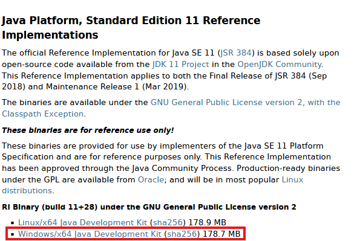
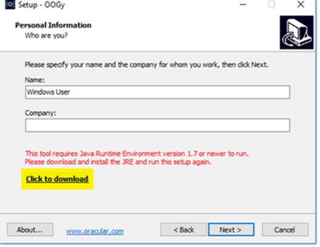

## Introduction

OOGy (Oracular Open Gateway) is a Rest API built using JAVA spring boot framework to expose Moca Layer. 
OOGy establish connections with the Moca environment through moca.jar to execute Moca commands and returns the response back to the consumer. 
OOGy API can be consumed by any client that can handle Rest API calls.

## Prerequisites

User should have Java installed on the system, as it is the prerequisite to installing OOGy.

### Java 
To Install Java, please follow the following steps.
If Java is already installed, please proceed to Step 2.
•	Download Java from the following link.
 https://jdk.java.net/java-se-ri/11   

•	Java will be downloaded to the computer.

 

•	Unzip and Copy java to the following location

,<b>Setting Environment Variables (Step2)</b>
•	Go to <b>Control Panel > System and Security > System > Advanced system settings </b>

•	Click on Environment Variables. 

 
•	Add the following variables as shown below  :
o	Click New button and add a variable OOGY_JAVA as shown below. Add the relevant path.

## Installation

OOGY app has two versions: Paid Mode and Trial. Paid Mode comes with complete set of features for the app and Trial version comes with basic functionality (Limited Features  ).
Let us get started with the Installation of OOGy App Paid Mode:

### Paid Mode
<b>Step 1:</b> 
Double click on following oogy-setup.exe file on the machine where the user wants to host the Webservice. User will need to “Run” the installer as Administrator account.

 
<b>Step 2:</b> 
Select language from the following dialog box:

 
<b>Step 3:</b> 
Click “Next” to continue, or “Cancel” to exit Setup.

 
<b>Step 4:</b>
User will need to fill in the details asked during the installation process, here it is “Name & Company”. Then click “Next” to continue.

 
<b>Step 5:</b>
If Java runtime environment is not installed, then a message will be displayed to download Java by clicking on “Click to download”. Once installed the user can proceed with OOGY Paid Mode Installation.

   
<b>Step 6:</b> 
Select Paid mode and click “Next” to continue installation.

  
<b>Step 7:</b>
Fill the registration information and proceed to next step.

 
<b>Step 8:</b>
This step shows Post Installation Instructions, which is to place Moca file in Installation directory as it is required by OOGy.

 

<b>Step 9:</b>
After reading the “License Agreement” User can select “I accept the agreement” and click “Next” to proceed or “I do not accept the agreement” to Cancel the Setup installation.

 
<b>Step 10:</b> 
User will then select the Location to install the App. It is used to run the OOGy Service.

 

<b>Step 11:</b>
There are two types of OOGy Services which can be installed. Select the Installation Type.

 
#### Install as a Service:
This will install the application and install OOGy as a service. It will   also start the OOGy service.

#### Install Manually: 
After installation Run startup.bat (C:\Program Files\OOGy). This will add OOGy as a service and start the OOGy service.

 

<b>Step 12:</b>
This step is to create a shortcut “Desktop Icon” for OOGy. Check the box if desktop icon is needed and click “Next”.

 
<b>Step 13:</b>
Once the setup is ready to begin installation, click “Install” to proceed.

   
<b>Step 14:</b>
Click “Finish” to exit the installation Setup & Launch OOGy.

### Trial Mode

<b>Step 1:</b> 
Double click on oogy-setup.exe file to start where the user wants to host Webservice. Run the installer as Administrator account.

 

<b>Step 2:</b> 
Select language from the following dialog box.
 

<b>Step 3:</b> 
Click “Next” to continue, or “Cancel” to exit Setup.
 

<b>Step 4:</b>
User will need to fill in the details asked during the installation process, here it is “Name & Company”. Then click “Next” to continue.
 
<b>Step 5:</b>
If Java runtime environment is not installed, then a message will be displayed to download Java by clicking on “Click to download”. Once installed the user can proceed with OOGY Paid Mode Installation.
 
 <b>Step 6:</b> 
Select Trial mode and click “Next” to continue installation.
 
<b>Step 7:</b>
This step shows Post Installation Instructions, which is to place Moca file in Installation directory as it is required by OOGy.
 

<b>Step 8:</b>
This here stats the Product Information, click “Next” to proceed.
   
<b>Step 9:</b>
After reading the “Agreement Terms” User can select “I accept the agreement” and click “Next” to proceed or “I do not accept the agreement” to cancel the installation. 
 
<b>Step 10:</b> 
Select the Location to install the application.
 
<b>Step 11:</b>
This step is to create a shortcut “Desktop Icon” for OOGy. Check the box if desktop icon is needed and click “Next”.
 
<b>Step 12:</b>
Once the setup is ready to begin installation, click “Install” to proceed.
 
<b>Step 13:</b>
Click “Finish” to exit the installation Setup. 
 
Click on the Finish Button to complete, now following two files config.yaml and application. Properties are in Program Data as shown Below and copy moca file from program files and paste it in the same folder (ProgramData).

## Configurations

### Config.Yaml file
Config.yaml is a configurable file at following location:
 

Configure Moca environments with the following key value parameters.
<b>ID:</b> Unique name of the server
<b>WH:</b> Warehouse ID 
<b>Service URL:</b> Moca Server URL

### Application.properties File
Edit the application.properties file and set the server. Port variable. This is the SSL PORT.
 
Copy Moca file to the installed location. This file is required for OOGy to connect with the Moca instances.

## Run Service

### Run Service Manually 
Open the location where OOGy is installed and double click on startup.bat to start OOGy
 

 

 
Run the webservice from Command Prompt as shown below.
   
### Start and Stop Service
User can start and stop OOGY service from the Windows Services as shown in the following image: Right click on the service name and there it can be stopped if in running state OR can be started if it is stopped.

### Paid Version Manual Installation Service

Right click on install.bat and Run the file as Administrator: 
  

### Paid Version Auto INstallation

In paid version Windows Service is already running
  
User can see service running in windows services as shown above.

### Simple OOGy Test

The webservice can be tested by launching the following URL in the browser.
http:<Webservice URL >/greeting
   
   
Browse <oogy url>/greeting to verify if the service is running or not.
     

