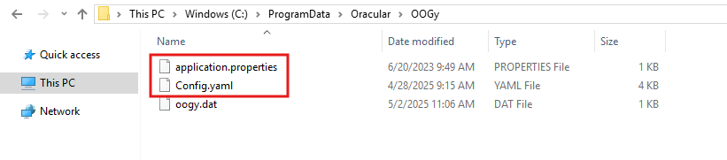
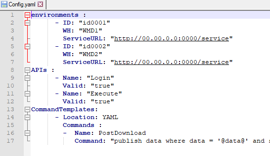
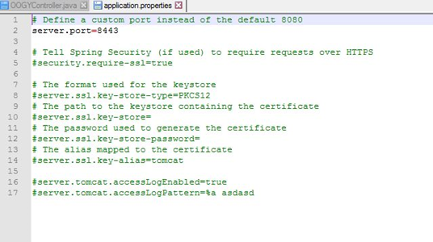
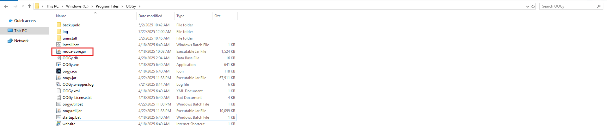
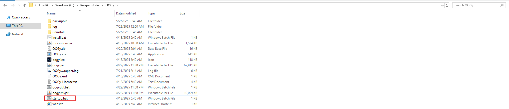
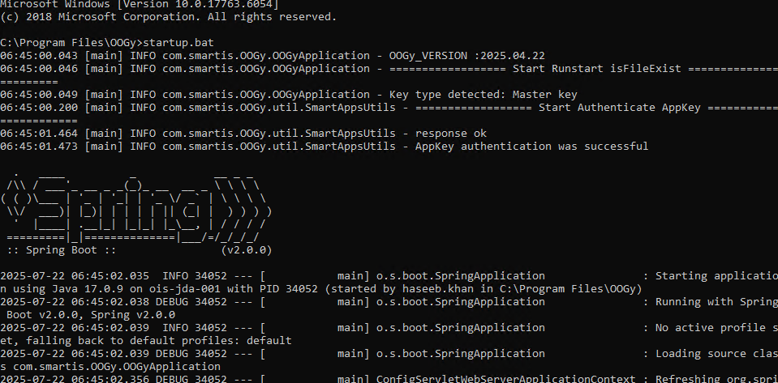
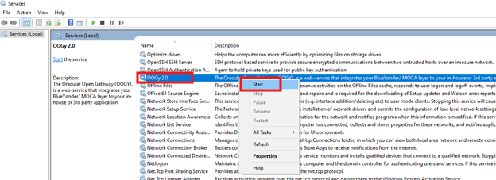

# OOGY Configurations Files

The below section will explain you how to configure OOGY.

The following two files are in Program Data as shown below.
1. **config.yaml**
2. **application.properties**
 

     
    

## 1. Config.Yaml File

Configure Moca environments with the following key value parameters.

- ID: Unique name of the server

- WH: Warehouse ID 

- Service URL: Moca Server URL

     
    

## 2.  Application.Property File

- Edit the application.properties file and set the server. Port variable. This is the SSL PORT.

     
    

- Copy Moca file to the installed location. This file is required for OOGy to connect with the Moca instances.

     
     

## Services

Below section will explain you how to start and stop services. 

### Run Service Manually ## 

Open the location where OOGY is installed and double click on startup.bat to start OOGY

     
    

     
    
This will initiate the services manually.

     
    

     

### Start and Stop Service

User can start and stop OOGY service from the Windows Services as shown in the following image: Right click on the service name and there it can be stopped if in running state OR can be started if it is stopped.

     
    

    

---
 