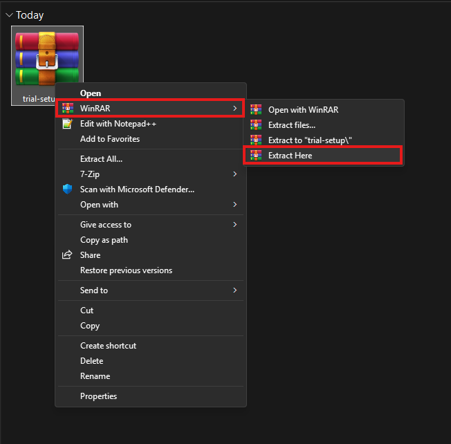
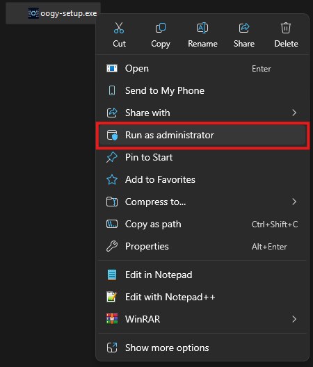
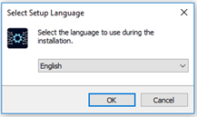
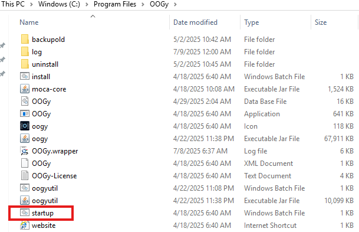

# Installation Options

The OOGY app is available in two versions:
1. Paid Mode Includes the full suite of features.
2. Trial Mode Offers basic functionality with limited features.

## 1. Paid Mode Installation

- Extract the downloaded zip folder (oogy-setup.exe) and open it.

    

     
     

- Double click on following oogy-setup.exe file on the machine where the user wants to host the Webservice. User will need to “Run” the installer as Administrator account.

    

     
     

- Select language from the following dialog box

    

     
     

- Click “Next” to continue, or “Cancel” to exit Setup.

    

     
     

- User will need to fill in the details asked during the installation process, here it is “Name & Company”. Then click “Next” to continue. 

     

     
      

- Select Paid mode and click “Next” to continue installation.

    

     
     

- Fill the registration information and proceed to next step.

    

     
     

- This step shows Post Installation Instructions, which is to place Moca file in Installation directory as it is required by OOGY.

   

     
     
 

- This here stats the Product Information, click “Next” to proceed.

  

     
     

- After reading the “License Agreement” User can select “I accept the agreement” and click “Next” to proceed or “I do not accept the agreement” to Cancel the Setup installation.

  

     
     

- User will then select the Location to install the App. It is used to run the OOGy Service.

    

     
     

- This step is to create a shortcut “Desktop Icon” for OOGy. Check the box if desktop icon is needed and click “Next”.

    

     
     

- Once the setup is ready to begin installation, click “Install” to proceed.

    

     
     

 

### Types Of OOGY Services

There are two types of OOGY Services which can be installed. 

  

     
     

**1. Install as a Service**

This will install the application and install OOGY as a service. It will also start the OOGY service.

**2. Install Manually**

After installation Run startup.bat (C:\Program Files\OOGY). This will add OOGY as a service and start the OOGY service.

     
     

- This step is to create a shortcut “Desktop Icon” for OOGy. Check the box if desktop icon is needed and click “Next”.

     
     

- Click “Finish” to exit the installation Setup & Launch OOGy.

     
     

   

Follow the guide below to set up Trial Version Of OOGY
[Trial Mode](installationtrialmode.md)

---
 